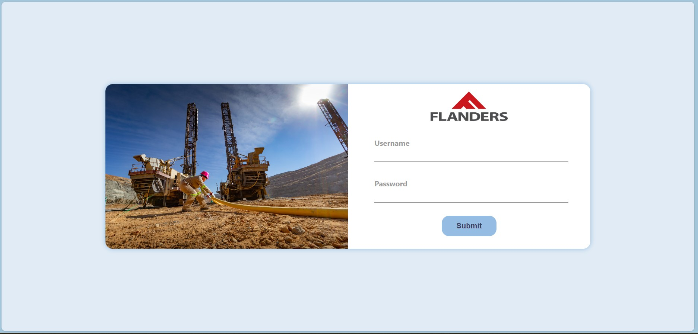

````markdown
# Flanders Frontend Coding Challenge - Elegant Login Page Solution

Greetings! 👋 I'm Jose Thankachan Mundackal, and I've crafted a delightful login page solution for you.

## Developer Details

- **Name:** Jose Thankachan Mundackal
- **Email:** josetm94mec@gmail.com

## Challenge Overview

### 1. Credentials

- **Username:** MAINT
- **Password:** safetyiskey

### 2. Simulated API Call

To mimic real-world scenarios, I've simulated the API call using the `setTimeout` function, with response intervals ranging between 100ms and 600ms.

### 3. Chosen Frontend Framework

For this challenge, I opted for React, bringing the power of TypeScript to ensure a robust and type-safe solution.

### 4. Thoughtful Design

I've carefully curated a visually pleasing design, incorporating the color #95bce2 seamlessly into the layout. Additionally, I've integrated a captivating image to enhance the user experience.

## Login Page

A quick glimpse of your solution.



## Getting Started

1. **Clone this repository:**
   ```bash
   git clone https://github.com/jmundackaltest/flanders-fe.git
   ```
````

2. **Navigate to the project directory:**

   ```bash
   cd your-repository
   ```

3. **Install dependencies:**

   ```bash
   npm install
   ```

   or

   ```bash
   yarn install
   ```

4. **Start the development server:**

   ```bash
   npm start
   ```

   or

   ```bash
   yarn start
   ```

## Submission

Feel free to explore the code, and I'm open to any feedback or questions you may have.

Happy coding! 🚀✨
